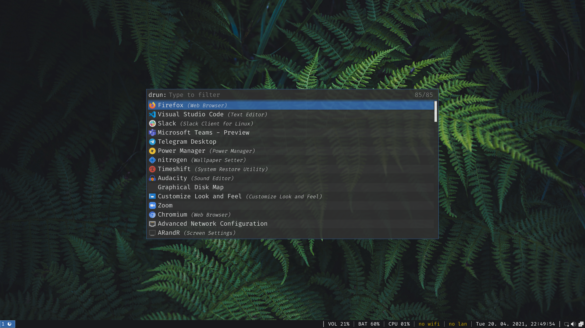
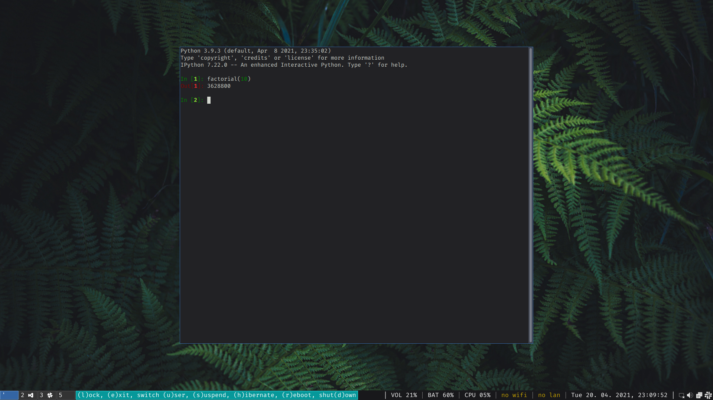
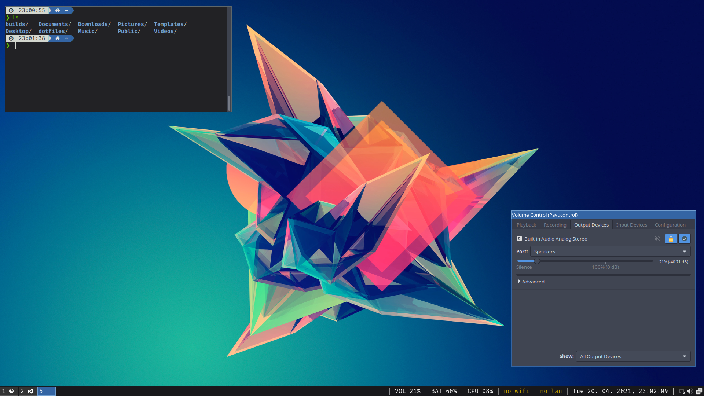
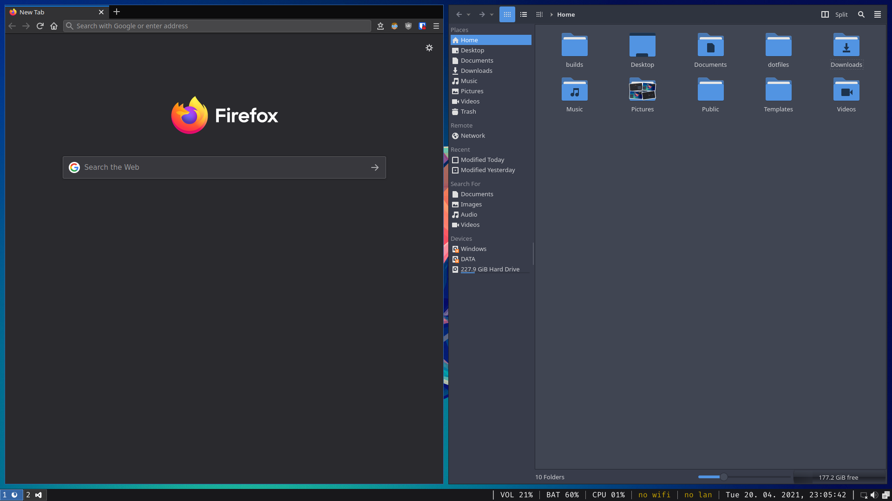

# Dotfiles

My Linux configuration files. Features:

- Boot loader: **Grub**
- Distro: **Arch Linux** (dual-booting with Windows 10)
- Display manager: **LightDM** with **LightDM GTK Greeter**
- Window manager: **i3-gaps** (for single-monitor as well as dual-monitor usage)
- Bar: **i3status**
- Menu: **Rofi**
- Notifications: **Dunst**
- File manager: **Thunar**
- Terminal emulator: **LXTerminal**
- Color palette: **Tango**
- Qt and GTK theme: **Arc Dark**
- Icon theme: **Papirus Dark**
- Cursor theme: **Breeze**
- System fonts: **Fira Code** and **Noto Sans**
- and more

In the case of interest take a look at the [setup guide](./setup.md).

## Screenshots

